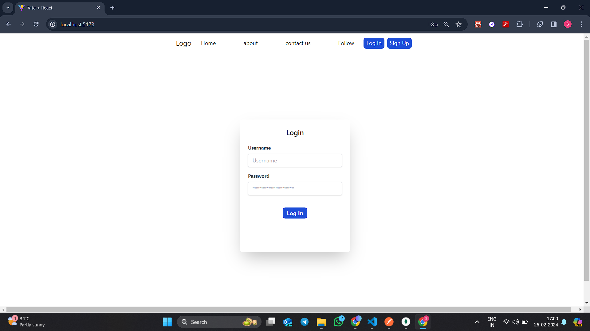
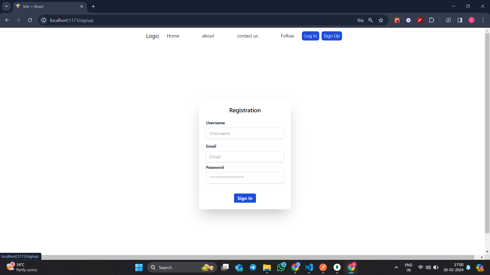

This project includes login and signup pages using React for the frontend and Express for the backend with JWT authentication. This is a basic template, and you might need to customize it based on the specifics of your project.
<h1>Login Page</h1>



<h1>SignUp Page</h1>


```markdown
# Project Title

A simple web application with login and signup functionality using React and Express with JWT authentication.

## Prerequisites

- Node.js installed on your machine

## Getting Started

1. Clone the repository:

   ```bash
   git clone https://github.com/shrikantg199/JWT-authentication_MERN
.git
   ```

2. Navigate to the project directory:

   ```bash
   cd JWT-authentication_MERN

   ```

### Frontend (React)

3. Navigate to the `frontend` directory:

   ```bash
   cd frontend
   ```

4. Install dependencies:

   ```bash
   npm install
   ```

5. Run the React+vite app:

   ```bash
   npm run dev
   ```

   The app will be accessible at http://localhost:5173.

### Backend (Express)

6. Navigate to the `backend` directory:

   ```bash
   cd backend
   ```

7. Install dependencies:

   ```bash
   npm install
   ```


8. Run the Express server:

   ```bash
   npm start
   ```

   The server will be running at http://localhost:5000.

## Usage

1. Open your browser and go to http://localhost:3000 to access the React app.
2. Use the navigation to go to the login and signup pages.
3. Submit the forms to create an account or log in.
4. The app uses JWT for authentication.

## Project Structure

- `Frontend`: Frontend React+vite application
- `Backend`: Backend Express application

## Technologies Used

- React
- Express
- JWT (JSON Web Tokens)
